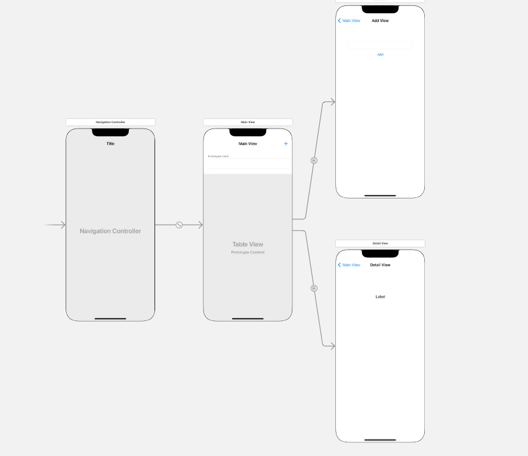
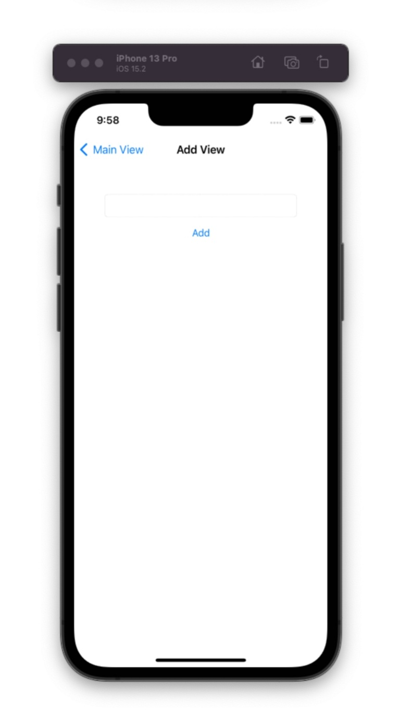
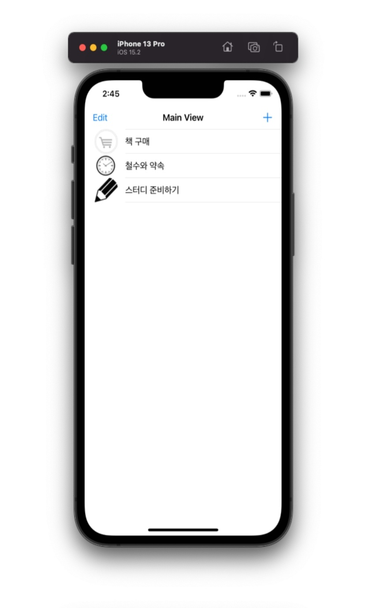
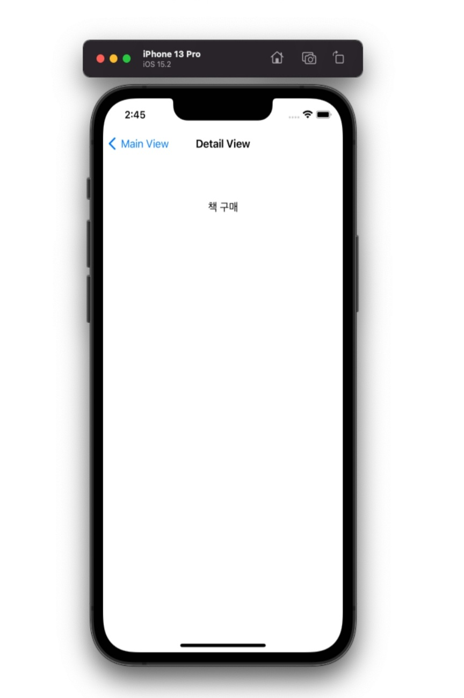

---

layout: single

classes: wide 

title:  "12장 스위프트 과제"

---

{: .notice--info}


 **[공지사항]**[스위프트 과제 다운로드 주소 이동.](https://github.com/mingyu16001/MobileSwift)


### 테이블 뷰 컨트롤러란?

알람 앱, 메모장 앱 등 아이폰 앱에서 자주 보고 익숙하게 사용하고 있는 '목록' 기능은 테이블 뷰 컨트롤러(Table View Controller)를 이용해서 구현할 수 있습니다. 이 장에서는 이 테이블 뷰 컨트롤러에 대해 설명해보겠습니다.


### 테이블 뷰 컨트롤러를 이용해 할 일 목록 앱 만들기.

할 일 목록 앱을 만들기 위해서는 테이블 뷰 컨트롤러를 사용해야 합니다. 이를 위해 스토리보드에서 기존에 있는 뷰 컨트롤러를 삭제하고 스위프트 파일도 삭제해야 합니다.

임의의 swift 파일을 클릭 후 Main.storyboard를 클릭하면 'ViewController.swift'가 사라지고 텅 빈 스토리보드만 보입니다.


- #### 스토리보드 꾸미기

할 일 목록을 보여주는 화면과 할 일을 추가하는 화면 그리고 목록 중 한 가지 할 일을 보여주는 화면, 이렇게 세 개의 화면을 만들어 보겠습니다. 할 일 추가 화면에서는 텍스트 필드를 이용하여 할 일을 추가하고, 할 일을 보여주는 화면에서는 레이블을 추가하겠습니다.

그리고 텅 빈 화면에 할 일 목록을 보여주는 테이블 뷰 컨트롤러와 두 개의 뷰 컨트롤러를 추가하고, 추가 화면으로 이동하기 위한 바 버튼 아이템, 추가할 일을 입력하기 위한 텍스트필드, 버튼을 추가하고 할 일을 보여줄 레이블을 추가하여 스토리보드를 꾸며 보았습니다.




- #### 아웃렛 변수와 액션 함수 추가하기

1. 아웃렛 변수와 액션 함수를 추가하기 위해 오른쪽 윗부분의[Adjust Editor Options] 버튼을 클릭한 후 [Assistant] 메뉴를 선택하여 보조 편집기 영역을 엽니다. 왼쪽 창에서 'Main View' 뷰 컨트롤러를 선택한 후 오른쪽 보조 편집기 영역의 클래스명을 보고 파일이 'TableViewController.swift'인지 확인합니다. 그리고 테이블뷰를 마우스 우클릭으로 선택한 후 드래그해서 오른쪽 보조 편집기 영역의 클래스 선언문 바로 아래에 갖다 놓습니다.
2. 왼쪽 창에서 'Detail View' 뷰 컨트롤러를 선택한 후 오른쪽 보조 편집기 영역의 클래스명을 보고 파일이 'DetailViewController.swift'인지 확인합니다. 그리고 레이블을 마우스 우클릭으로 선택한 후 드래그해서 오른쪽 보조 편집기 영역의 디테일 뷰 컨트롤러 클래스 선언문 바로 아래에 갖다 놓습니다.


- #### 테이블 목록 보여주기

앱을 실행했을 때 기본적으로 아이콘이 포함된 세 개의 목록이 나타나게 하기 위해서 목록과 함께 아이콘으로 사용될 이미지를 추가하고 목록을 보여주는 코드를 작성해 보았습니다

1. 목록 앱을 만들 때 사용할 이미지 파일을 추가합니다.
2. 왼쪽의 내비게이터 영역에서 [TableViewController.swift]를 선택합니다. 그리고 아래의 소스를 입력하여 앞에서 추가한 이미지 파일을 외부 변수인 'items'와 'ItemsImageFile'로 선언합니다. 이렇게 하면 모든 클래스에서 이미지를  사용할 수 있습니다.
3. 


- #### 목록 삭제하기

테이블 뷰 컨트롤러를 이용한 앱에서는 특정 항목을 선택해 바로 옆으로 밀면 삭제할 수 있으며, 목록을 밀어서 삭제하는 방법 외에 바 버튼을 이요하는 방법도 있습니다. 이처럼 목록을 삭제하는 동작을 코딩해 보았습니다.


- #### 목록 순서 바꾸기

목록을 적다 보면 우선순위대로 중요한 목록을 위로 올리고 싶어질 때가 있습니다. 이를 위해서는 목록의 순서를 바꾸는 기능이 필요합니다. 앞에서 만든 Edit 버튼을 활용해 이번엔 목록을 바꿔보았습니다.

1. tableView 함수 앞뒤의 '/* '과 '*/'를 지워서 주석을 제거합니다. 이 함수를 사용하면 목록을 옮길 수 있습니다.
2. tableView 함수 안에 하나의 목록을 선택하여 다른 곳으로 이동하는 소스를 추가합니다. 먼저 변수를 만들어서 이동할 변수를 기억한 후 이동할 목록을 삭제하고 변수에 저장된 내용을 이동한 곳으로 삽입합니다.


- #### 새 목록 추가하기

처음에 만든 'Add View'와 [+] 버튼을 활용하여 새 목록을 추가하는 기능을 구현해 보겠습니다.

1. 새 목록을 추가하는 코드를 작성해 보겠습니다. [AddViewController.swift]를 선택한 후 btnAdditem(_sender: UIButton)함수를 수정합니다.
2. 앱을 실행합니다. 화면 오른쪽에 있는[+] 버튼을 클릭하면 'Add View'로 이동하고, 텍스트 필드에 내용을 입력한 후 [Add] 버튼을 클릭하면 다시 'Main View'로 돌아오는 것까지는 잘 구현되었으나 아직 내용이 추가되지 않는 것을 확인할 수 있습니다.
3. 2번의 결과 보기에서와 같이 내용이 추가되지 않았는데 이것이 제대로 작동되도록 viewWillAppear 함수를 추가하여 수정해 보았습니다. 이 함수는 뷰가 전환될 때 호출되는 함수로, 리스트가 추가되어 'Main View'로 돌아올 때 호출되며 추가도니 내용을 리스트에 보여줍니다.


### 할 일 목록앱, 전체 소스

```swift
import UIKit

//앱 시작 시 기본적으로 나타낼 목록
var items = ["책 구매", "철수와 약속", "스터디 준비하기"]
var itemsImageFile = ["cart.png", "clock.png", "pencil.png"]

class TableViewController: UITableViewController {

    @IBOutlet var tvListView: UITableView!
    override func viewDidLoad() {
        super.viewDidLoad()
        self.navigationItem.leftBarButtonItem = self.editButtonItem
    }

    //뷰가 노출될 때마다 리스트의 데이터를 다시 불러옴
    override func viewWillAppear(_ animated: Bool) {
        tvListView.reloadData()
    }
    
//테이블 안의 섹션 개수를 1로 설정함
    override func numberOfSections(in tableView: UITableView) -> Int {
        return 1
    }

    //섹션당 열의 개수를 전달
    override func tableView(_ tableView: UITableView, numberOfRowsInSection section: Int) -> Int {
        return items.count
    }
    
    //items와 itemsImageFile의 값을 셀에 삽입함.
    override func tableView(_ tableView: UITableView, cellForRowAt indexPath: IndexPath) -> UITableViewCell {
        let cell = tableView.dequeueReusableCell(withIdentifier: "myCell", for: indexPath)
        cell.textLabel?.text = items[(indexPath as NSIndexPath).row]
        cell.imageView?.image = UIImage(named: itemsImageFile[(indexPath as NSIndexPath).row])
        return cell
    }
	//목록 삭제 함수
    override func tableView(_ tableView: UITableView, commit editingStyle: UITableViewCell.EditingStyle, forRowAt indexPath: IndexPath) {
        if editingStyle == .delete {
            //items와 itemsImageFile에서 해당 리스트를 삭제함
            items.remove(at: (indexPath as NSIndexPath).row)
            itemsImageFile.remove(at: (indexPath as NSIndexPath).row)
            tableView.deleteRows(at: [indexPath], with: .fade)
        } else if editingStyle == .insert {
        }    
    }
//목록 순서 바꾸기
    override func tableView(_ tableView: UITableView, moveRowAt fromIndexPath: IndexPath, to: IndexPath) {
        let itemToMove = items[(fromIndexPath as NSIndexPath).row]
        let itemImageToMove = itemsImageFile[(fromIndexPath as NSIndexPath).row]
        items.remove(at: (fromIndexPath as NSIndexPath).row)
        itemsImageFile.remove(at: (fromIndexPath as NSIndexPath).row)
        items.insert(itemImageToMove, at: (to as NSIndexPath).row)
        itemsImageFile.insert(itemImageToMove, at: (to as NSIndexPath).row)
    }

    override func prepare(for segue: UIStoryboardSegue, sender: Any?) {

        if segue.identifier == "sgDetail" {
            let cell = sender as! UITableViewCell
            let indexPath = self.tvListView.indexPath(for: cell)
            let detailView = segue.destination as! DetailViewController
            detailView.receiveItem(items[((indexPath! as NSIndexPath).row)])
        }
    }
}
```


### 할 일 목록 앱 완성된 모습


