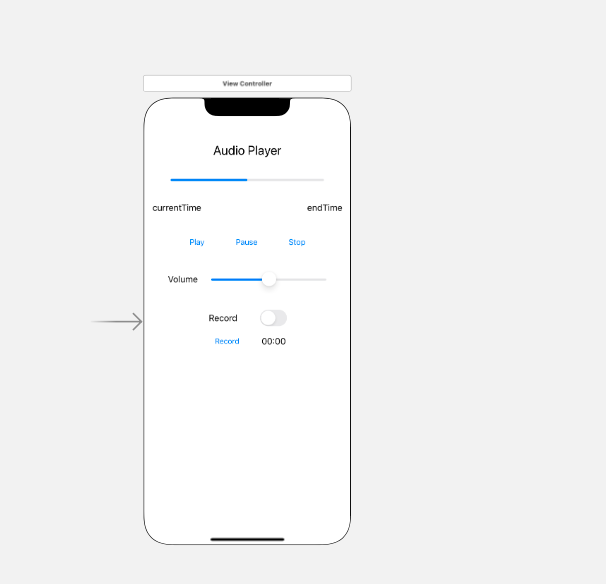

---

layout: single

classes: wide 

title:  "13장 스위프트 과제"

---

{: .notice--info}


 **[공지사항]**[스위프트 과제 다운로드 주소 이동.](https://github.com/mingyu16001/MobileSwift)


### AVAudioPlayer란?

아이폰에서는 대부분의 정보를 화면을 통해 제공하지만 간혹 소리를 이용해 정보를 제공하기도 합니다. 예를 들어 운전 중일 때 화면을 통한 정보 제공은 위험합니다. 이때는 소리를 이용한 정보 전달이 가장 효과적인 방법일 것입니다.

IOS에서는 기본적으로 음악 재생 앱과 녹음 앱을 제공합니다. 오디오 파일을 재생할 수 있다면 벨소리나 알람과 같이 각종 소리와 관련된 다양한 작업을 할 수 있습니다. 또한 일정 관리 앱에 녹음 기능을 추가해 목소리로 메모를 하는 등 메인 기능이 아닌 서브 기능으로도 사용할 수 있습니다. 오디오를 재생하는 방법 중 가장 쉬운 방법은 AVAudioPlayer를 사용하는 것입니다.

이 장에서는 AVAudioPlayer를 이용하여 오디오 파일을 재생, 일시 정지 및 정지하는 방법과 볼륨을 조절하는 방법 그리고 녹음하는 방법을 설명하겠습니다.


### 오디오 재생 및 녹음을 위한 기본 환경 구성하기

오디오 재생 앱은 다양한 형태로 만들 수 있습니다. 하지만 이 장에서는 가장 기본적인 기능을 수행하는 형태의 앱을 만들 것입니다. 앞에서 사용했던 버튼과 레이블 외에 프로그레스 뷰(Progress View), 슬라이더(Silder)도 만들어 보겠습니다.


- #### 스토리보드 꾸미기

각종 타이틀을 쓰기 위한 레이블, 오디오 재생 밑 녹음을 위한 버튼, 오디오 재생 정도를 보여줄 프로그레스 뷰, 볼륨 조절을 위한 슬라이더 그리고 재생 모드와 녹음 모드를 선택할 스위치를 추가하고 스택 뷰를 추가하여 스토리보드를 꾸며보았습니다.




- #### 아웃렛 변수와 액션 함수 추가하기

1. 아웃렛 변수와 액션 함수를 추가하기 위해 보조 편집기 영역을 엽니다.
2. 프로그레스 뷰를 마우스 우클릭으로 드래그해서 오른쪽 보조 편집기 영역에 놓습니다.
3. 연결 설정 창에서 아웃렛 변수의 이름을 'pvProgressPlay'로 입력하고 타입을 확인한 후 아웃렛 변수를 추가합니다.
4. 3번과 같은 방법으로 왼쪽 창에서 currentTime과 endTime을 선택한 후 오른쪽 보조 편집기 영역에서 생성한 아웃렛 변수 바로 아래에 끌어다 놓습니다. 연결 설정 창에서 아웃렛 변수의 이름은 각각 'lblCurrentTime', 'lblEndTime'으로 입력하고 타입을 확인합니다.
5. 이번엔 버튼 세 개의 아웃렛 변수를 추가하였습니다. 추가하는 방법은 앞에서 한 것과 동일합니다. 마우스 우클릭으로 버튼 세 개를 각각 끌어다 편집기 영역에 갖다 놓습니다.
6. 슬라이더도 동일한 방법으로 아웃렛 변수의 바로 아래에 끌어다 놓습니다.
7. 연결 설정 창에서 아웃렛 변수의 이름을 'slVolume'으로 입력하고 타입을 확인한 후 [Connect] 버튼을 클릭합니다.
8. 아웃렛 변수는 모두 추가했으니 이제 액션 함수를 추가하겠습니다. 왼쪽 창에서 [play] 버튼을 마우스 우클릭으로 드래그해서 소스의 가장 아래쪽 '}' 바로 위에 갖다 놓습니다.
9. 연결 설정 창에서 이름을 'btnPlayAudio'로 입력하고, 타입은 기기의 액션을 추가하는 것이므로 [UIButton]으로 변경합니다. 변경을 완료한 후 [connect] 버튼을 클릭하여 추가합니다.
10. 나머지 버튼 [Pause]와 [Stop]의 액션 함수도 같은 방법으로 추가합니다.
11. 마지막으로 왼쪽 창에서 슬라이더를 우클릭으로 드래그해서 10에서 추가한 액션 함수 아래에 갖다 놓습니다.
12. 연결 설정 창에서 이름을 'slChangeVolume'으로 입력하고, 타입은 스랄이더의 액션을 추가하는 것이므로 [UISlider]를 선택합니다. 변경을 완료한 후 [Connect] 버튼을 클릭하여 추가합니다.


### 오디오 재생을 위한 초기화하기

실제로 오디오를 재생하려면 오디오 파일을 불러오고 추가 설정도 해야 합니다. 추가 설정이 필요한 부분은 소리의 크기를 조절하기 위한 볼륨, 볼륨을 표시할 슬라이더, 재생 시간을 표시하기 위한 타이머, 재생 정도를 표시할 프로그레스 뷰 등입니다. 또한 오디오를 재생하려면 '초기화'라는 중요한 단계를 거쳐야 합니다. 여기서 초기화란 오디오를 재생하기 위한 준비 과정까지 말합니다. 이 초기화는 재생뿐만 아니라 녹음할 때도 피룡하므로 개념을 잘 이해해야 합니다.


### 재생 시간 초기화하기

앞에서 말했듯이 오디오 재생을 위한 초기화에 괂여하는 것은 '재생 시간'과 '버튼'입니다. 먼저 재생 시간을 초기화해 보겠습니다.

1. 'endTime' 레이블인 lblEndTime에 총 재생 시간을 나타내기 위해 lblEndTime을 초기화하겠습니다. 이때 오디오의 총 재생 시간인 audioPlayer.duration을 직접 사용하고 싶지만 시간 형태가 초 단위 실수 값이므로 "00:00" 형태로 바꾸는 함수를 만들어야 합니다. 입력될 코드는 아직 완성되지 않았기 때문에 왼쪽에 빨간색 경고등이 켜지는데, 이것은 코드를 완성하고 나면 사라집니다.
2. "00:00" 형태로 바꾸기 위해 TimeInterval  값을 받아 문자열로 돌려보내는 함수 convertNSTimeInterval2String를 생성합니다.
3. convertNSTimeInterval2String 함수 안에 구체적인 코드를 입력하겠습니다.
4. 초기화한 값을 'endTime' 레이블인 lblEndTime에 나타내겠습니다.

### [재생], [일시 정지], [정지] 버튼 제어하기

재생 시간을 초기화했으니 이제는 버튼을 제어해 보겠습니다. 오디오를 재생, 일시 정지, 정지했을 때 각 버튼의 활성화 및 비활성화를 구현해보겠습니다.

1. [Play] 버튼은 오디오를 재생하는 역할을 하고 다른 두 버튼은 오디오를 멈추게 합니다. 그러므로 재생에 관한 함수인 initPlay 함수에 [Play] 버튼은 활성화, 나머지 두 버튼은 비활성화 하도록 코드를 추가합니다.
2. [Play], [Pause], 그리고 [Stop] 버튼의 동작 여부를 설정하는 부분은 앞으로도 계속 사용해야 하므로 함수를 따로 만들었습니다. 이렇게 만든 함수에 '재생', '일시정지' 그리고 '정지'의 순으로 ture, false 값을 주면서 각각 설정할 것입니다.

### 재생 시간 표시하고 볼륨 제어하기

앞의 결과를 보면 재생 시간은 00:00으로 변화가 없습니다. 타이머를 이용하여 재생 시간이 제대로 작동되도록 구현해 보겠습니다.

1. 우선 btnPlayAudio 함수를 수정하겠습니다. 프로그레스 타이머에 Timer.scheduledTimer 함수를 사용하여 0.1초 간격으로 타이머를 생성하도록 구현하겠습니다. 셀렉터는 앞에서 선언한 상수 timePlayerSelector를 사용합니다. 상수 사용 시 에러가 발생하지만 바로 셀렉터 상수를 선언하여 해결할 수 있었습니다.
2. 아웃렛 변수를 선안한 위치 바로 위에 재생 타이머를 위한 상수를 추가합니다.
3. updatePlayTime 함수를 생성합니다. 앞에서 만든 타이머에 의해 0.1초 간격으로 이 함수가 실행되는데, 그 때마다 audioPlayer.currentTime,  즉 재생 시간을 레이블 'lblCurrentTime'과 프로그레스 뷰에 나타냅니다.
4. 재생 중일 때 시간이 표시되도록 만들었으니 이번에는 정지했을 때 시간이 00:00이 되도록 만들겠습니다. '정지'했을 때의 상황이므로 btnStopAudio 함수를 수정합니다.
5. 이제는 볼륨을 조절하기 위해 slChangeVolume 함수를 수정하겠습니다. 화면의 슬라이더를 터치해 좌우로 움직이면 볼륨이 조절되도록 할 것입니다. 이 동작을 구현하기 위해 슬라이더인 slVolume의 값을 오디오 플레이어의 volume 값에 대입합니다.
6. 마지막으로 오디오 재생이 끝나면 맨 처음으로 돌아가도록 함수를 추가하겟습니다. 타이머도 무효화하고 버튼도 다시 정의해야 합니다. 재생이 끝났으므로 [Play] 버튼은 활성화, 나머지 버튼은 비활성화합니다.


### 녹음을 위한 스토리보드 꾸미기

앞에서는 오디오 '재생 모드'에 관해 살펴보았습니다. 이젠 '녹음 모드'를 위한 작업을 시작해 보겠습니다.

1. 먼저 앞에서 만든 스토리보드에 추가 작업을 진행하겠습니다. 왼족의 내비게이터 영역에서 스토리보드를 클릭합니다. 그리고 [Library] 버튼을 클릭한 후 레이블을 찾아 앞에서 만든 레이블 아래쪽에 끌어다 놓습니다.
2. 스위치 또한 Record의 오른쪽에 끌어다 놓습니다.
3. [Library] 버튼을 스위치의 아래쪽에 끌어다 놓습니다.
4. 녹음 시간을 표시할 레이블을 추가합니다. [Record] 버튼 오른쪽에 끌어다 놓고 '00:00'으로 수정합니다.
5. 레이블과 시위치를 선택한 후 스택 뷰로 묶습니다.
6. 또한 버튼과 레이블을 선택한 후 스택뷰로 묶습니다.
7. 두 스택뷰를 선택한 후 스택뷰로 묶습니다.
8. 그리고 묶은 세로 스택 뷰를 선택하고 하단의 정렬조건 아이콘을 클릭한 후 수평을 가운데 정렬로 적용합니다.


### 녹음을 위한 아웃렛 변수와 액션 함수 추가하기

스토리보드에서 새로 추가한 객체에 아웃렛 변수와 액션 함수를 추가해 보았습니다.


### 녹음 및 재생모드 변경

앞에서 아웃렛 변수와 액션 함수를 추가해 보았습니다. 이제는 녹음을 구현해 보겠습니다. 녹음할 때 새로운 파일에 녹음이 입혀져야 하고, 녹음 시간과 버튼도 새로 설정해야 합니다. 앞에서 '재생 모드'를 만들기 위해 초기화를 한 것처럼 '녹음 모드'를 만들기 위한 초기화도 진행 해 보았습니다.

'녹음 모드'를 기본 설정을 마치고 실제로 녹음이 가능하도록 만들어 보았습니다.

앞의 단계까지 진행했을 때 녹음은 되지만 녹음 시간은 변하지 않았습니다. 이번에는 녹음할 때 아래에 녹음 시간이 표시되도록 만들어 보겠습니다. 시간이 표시되도록 하기 위해서는 앞에서 '재생 시간'을 표시한 것처럼 타이머를 사용해야 합니다.


### 오디오 앱, 전체 소스

``` swift
import UIKit

 
var items = ["책 구매", "철수와 약속", "스터디 준비하기"]
var itemsImageFile = ["cart.png", "clock.png", "pencil.png"]

class TableViewController: UITableViewController {

    @IBOutlet var tvListView: UITableView!
    override func viewDidLoad() {
        super.viewDidLoad()

        self.navigationItem.leftBarButtonItem = self.editButtonItem
    }

    override func viewWillAppear(_ animated: Bool) {
        tvListView.reloadData()
    }

    override func numberOfSections(in tableView: UITableView) -> Int {
        return 1
    }

    override func tableView(_ tableView: UITableView, numberOfRowsInSection section: Int) -> Int {
        return items.count
    }

    override func tableView(_ tableView: UITableView, cellForRowAt indexPath: IndexPath) -> UITableViewCell {
        let cell = tableView.dequeueReusableCell(withIdentifier: "myCell", for: indexPath)
        cell.textLabel?.text = items[(indexPath as NSIndexPath).row]
        cell.imageView?.image = UIImage(named: itemsImageFile[(indexPath as NSIndexPath).row])
        return cell
    }

    override func tableView(_ tableView: UITableView, commit editingStyle: UITableViewCell.EditingStyle, forRowAt indexPath: IndexPath) {
        if editingStyle == .delete {
            items.remove(at: (indexPath as NSIndexPath).row)
            itemsImageFile.remove(at: (indexPath as NSIndexPath).row)
            tableView.deleteRows(at: [indexPath], with: .fade)
        } else if editingStyle == .insert {
        }    
    }

    override func tableView(_ tableView: UITableView, moveRowAt fromIndexPath: IndexPath, to: IndexPath) {
        let itemToMove = items[(fromIndexPath as NSIndexPath).row]
        let itemImageToMove = itemsImageFile[(fromIndexPath as NSIndexPath).row]
        items.remove(at: (fromIndexPath as NSIndexPath).row)
        itemsImageFile.remove(at: (fromIndexPath as NSIndexPath).row)
        items.insert(itemImageToMove, at: (to as NSIndexPath).row)
        itemsImageFile.insert(itemImageToMove, at: (to as NSIndexPath).row)
    }

    override func prepare(for segue: UIStoryboardSegue, sender: Any?) {

        if segue.identifier == "sgDetail" {
            let cell = sender as! UITableViewCell
            let indexPath = self.tvListView.indexPath(for: cell)
            let detailView = segue.destination as! DetailViewController
            detailView.receiveItem(items[((indexPath! as NSIndexPath).row)])
        }
    }
}
```

### 오디오 앱, 완성된 모습


