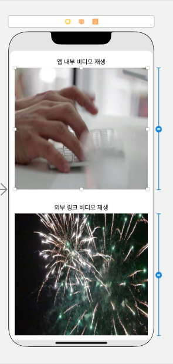
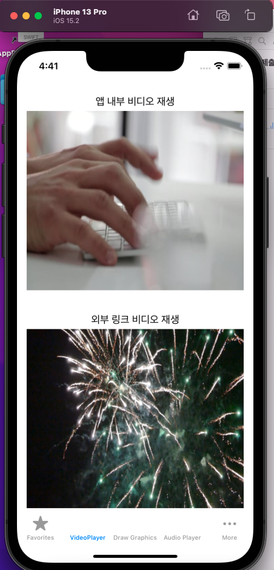
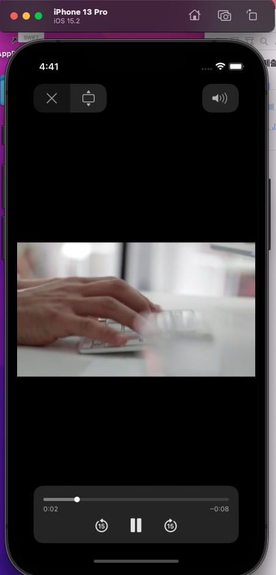
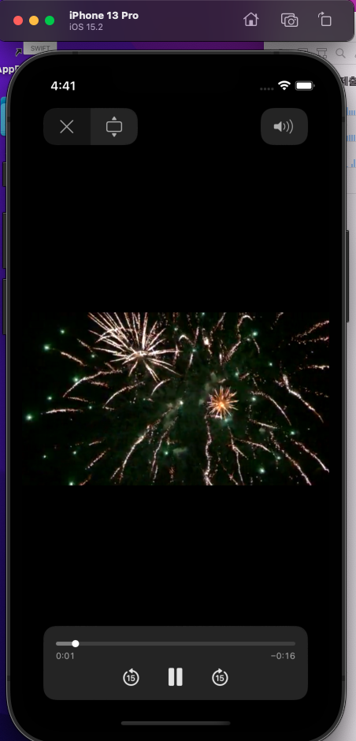

---

layout: single

classes: wide 

title:  "14장 스위프트 과제"

---

{: .notice--info}


 **[공지사항]**[스위프트 과제 다운로드 주소 이동.](https://github.com/mingyu16001/MobileSwift)


### 비디오 재생 앱이란?

비디오 플레이어는 아이폰 사용자들이 가장 많이 사용하는 앱 중의 하나입니다. 등하굣길이나 출퇴근길에 영화를 감상하거나 동영상 강의를 듣는 사용자들을 쉽게 볼 수 있습니다.

이 장에서는 아이폰 앱에서 비디오 파일을 재생하는 방법에 대해 설명하겠습니다. 애플 IOS에서 제공하는 AVPlayerViewController를 사용하면 앱 내부에 저장되어 있는 비디오 파일뿐만 아니라 외부에 링크된 비디오 파일도 간단하게 재생할 수 있습니다.


### 비디오 재생 앱을 위한 기본 환경 구성하기

비디오 재생 앱을 만들기 위한 기본 작업을 진행하겠습니다. 앱을 만들 때 필요한 파일을 추가하고 스토리보드를 꾸민 다음 버튼을 이미지로 만듭니다.

1. 앞으로 우리가 만들 스토리보드는 스택 뷰와 레이블, 버튼을 사용하여 배치할 것입니다.
2. 세로 스택뷰를 선택하여 스토리보드 위에 배치하고, 오른쪽 인스펙터 영역에서 정렬방법을 [center]로 설정합니다. 그런 다음 하단의 제약 조건 아이콘을 클릭하여 제약조건을 입력해줍니다.
3. 이제 필요한 객체들을 스택 뷰 안에 넣어줍니다.
4. 스토리보드의 화면을 보면 아래 이미지가 아래쪽으로 약간 치우친 것을 확인할 수 있습니다. 이것은 앞에서 스택뷰의 아래 제약조건을 지정하지 않았기 때문이므로 이미지의 크기나 디바이스의 크기에 따라 여백이 많이 남거나 넘칠 수 있습니다. (처음부터 네 방향의 제약조건을 모두 지정해도 되겠지만 객체들의 크기가 원치 않는 크기로 나타날 수 있기 때문에 우선은 아래 제약조건은 지정하지 않고 레이아웃을 한 후 마지막에 지정하는것이 좋습니다.)



### 액션 함수 추가하기/비디오 재생 앱 기능 구현하기

버튼을 클릭했을 때 동작할 액션 함수를 추가해 주었습니다.

두 개의 버튼에 각각 '내부 비디오'와 '외부 링크 비디오'를 재생하는 코드를 작성해 보았습니다. 그리고 두 코드에서 동일하게 입력한 부분을 새로운 함수로 정의했습니다.

[실행] 버튼을 클릭하여 앱을 실행해 보았을 때 비디오를 재생할 수 있습니다. [앱 내부 비디오 재생]은 앱 내부에 복사해 놓은 비디오 파일을 직접 재생하고, [외부 링크 비디오 재생]은 외부의 링크를 불러와 재생합니다.


### 비디오 재생 앱, 전체 소스

``` swift
import UIKit
import AVKit

class MoviePlayerViewController: UIViewController {

    override func viewDidLoad() {
        super.viewDidLoad()
    }

    @IBAction func btnPlayInternalMovie(_ sender: UIButton) {
        // 비디오 파일명을 사용하여 비디오가 저장된 앱 내부의 파일 경로를 받아옴
        let filePath:String? = Bundle.main.path(forResource: "FastTyping", ofType: "mp4")
        // 앱 내부의 파일명을 NSURL 형식으로 변경
        let url = NSURL(fileURLWithPath: filePath!)
        playVideo(url: url)	// 앞에서 얻은 url을 사용하여 비디오를 재생
    }

    @IBAction func btnPlayExternalMovie(_ sender: UIButton) {
        // 외부에 링크된 주소를 NSURL 형식으로 변경
        let url = NSURL(string: "https://dl.dropboxusercontent.com/s/e38auz050w2mvud/Fireworks.mp4")!
        playVideo(url: url)	// 앞에서 얻은 url을 사용하여 비디오를 재생
    }

    private func playVideo(url: NSURL) {
        // AVPlayerViewController의 인스턴스를 생성
        let playerController = AVPlayerViewController()
        // 비디오 URL로 초기화된 AVPlayer의 인스턴스를 생성
        let player = AVPlayer(url: url as URL)
        // AVPlayerViewController의 player 속성에 위에서 생성한 AVPlayer 인스턴스를 할당
        playerController.player = player
        self.present(playerController, animated: true) {
            player.play()
        }
    }
}
```

### 비디오 재생 앱, 완성된 모습







