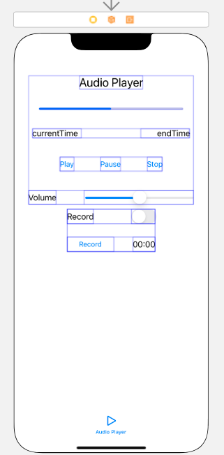

{: .notice--info}


 **[공지사항]**[스위프트 과제 다운로드 주소 이동.](https://github.com/mingyu16001/MobileSwift)


### Mobile Swift 기말고사 과제

저는 탭 바 컨트롤러를 이용해 수업중 만들었던 앱 들을 넣어보았습니다.

또한 메인 화면에 저의 github 페이지를 띄우고, 상단에 url을 직접 입력해 다른 사이트 또한 접속할 수 있도록 만들어보았습니다.


IOS에서 하나의 앱에 여러 화면을 넣을 때 일반적으로 많이 사용하는 것이 '탭 바' 입니다. 탭 바는 위의 그림에서 Tap Bar Controller의 밑에 늘어서 있는 아이콘 모양의 탭 부분을 말합니다. 각각의 탭을 선택할 때마다 다른 화면을 볼 수 있을 뿐만 아니라 화면을 이동할 때도 탭을 선택하면 되므로 쉽게 여러 개의 화면을 넣을 수 있습니다.

이번 과제에서는 수업중 만들어 놓은 예제를 활용해 초기 화면에 저의 github 페이지를 띄우고 추가로 5개의 화면을 넣어보았습니다. 이를 통해 기존의 프로젝트에서 스토리보드의 뷰 컨트롤러의 가져오는 방법과 탭 바 컨트롤러에 대해 알아볼 수 있었습니다.

### 탭 바 컨트롤러란?

앞에서 배운 예제들은 대부분 '하나의 뷰'만 보여 주었습니다. 하지만 상황에 따라 하나의 뷰가 아니라 다양한 내용, 즉 여러 개의 뷰를 보여 줄 때가 더 많습니다. 이를 위해 여러 개의 뷰와 더불어 뷰를 선택해 이동할 수 있게 해주는 컨트롤러가 필요합니다. 그 역할을 하는것이 바로 탭 바 컨트롤러 입니다. 이를 활용하여 비디오 재생 앱, 오디오 재생 앱, Sketch 앱, Tap/Touch 앱, 코어 그래픽스 앱을 탭으로 구분하여 상황에 맞게 하나의 앱으로 사용할 수 있습니다.


### 탭 바 컨트롤러 앱을 위한 기본 환경 구성

탭 바를 사용하기 위해 탭 바 컨트롤러를 추가하고 기본 뷰를 추가한 후 기본 뷰의 탭 바 아이콘을 수정해 보았습니다.

### 탭 바에 뷰 추가하기

탭 바의 기본 뷰 이외에 5개의 뷰를 추가해 보았습니다. 이때 5개의 뷰를 새로 만드는 것이 아니라 수업시간에 작성했던 이미지와 스토리보드 및 소스코드를 추가하여 사용했습니다.

1. 먼저 파인더를 이용하여 오디오 소스, 비디오 파일을 추가했습니다. 해당 파일들을 왼쪽의 내비게이터 영역에 추가했습니다.
2. 스위프트 파일도 그대로 사용합니다. 프로젝트에 이미 동일한 이름의 파일이 존재하므로 파일을 복사하여 다른 이름으로 수정합니다.
3. 스위프트 파일을 왼쪽의 내비게이터 영역에 추가합니다.
4. 3번에서 스위프트 파일을 선택하면 에러가 발생합니다. 이 에러는 파일명과 클래스명이 다르기 때문에 발생한 것이므로 클래스명을 파일명에 맞게 수정하면 잠시 뒤 에러가 사라집니다.
5. 이제 뷰 컨트롤러를 복사하겟습니다. Base.1proj 폴더 안으로 들어가면 Main.storyboard 파일을 볼 수 있습니다. 이 파일을 더블 클릭하여 실행합니다.
6. 새로운 스토리보드 화면이 나타나면 뷰 컨트롤러가 모두 포함되도록 드래그하여 선택한 후 복사합니다. 아래 버튼과 스위치의 위치가 너무 아래쪽에 있을 경우 탭바와 겹치게 되므로 아래쪽에 여유가 있도록 위치를 조정합니다.
7. 프로젝트로 돌아와 스토리보드 상에서 스토리보드의 빈 곳을 클릭한 후 북텨넣으면 복사한 뷰 컨트롤러가 보입니다.
8. 복사한 뷰 컨트롤라를 선택한 후 오른쪽 윗부분의 Identity inspector 버튼을 클릭하면 Class가 ViewController로 되어 있는것을 확인 할 수 있습니다.
9. Class를 각각의 스위프트 파일에 맞게 선택하면 스토리보드에 뷰 컨트롤러와 스위프트 파일이 제데로 등록된 것을 확인 할 수 있습니다.
10. 이제 뷰 컨트롤러에 탭 바를 적용하겟습니다.
11. 'Tap bar Controller'라고 적힌 뷰 컨트롤러를 마우스 우클릭으로 드래그한 후 방금 복사한 뷰 컨트롤러 안의 빈 공간에 드래그하고 마우스 버튼에서 손을 뗍니다.
12. 버튼에서 손을 떼면 나타나는 검은 창에서 [view controllers]를 선택합니다.
13. 이렇게 하면 뷰 컨트롤러가 화살표로 연결됩니다. 이것은 세그웨이가 제대로 추가되었다는 의미입니다. 이렇게 화살표가 제대로 그려지면 화면 전환이 잘 이루어질 것입니다.


### 첫 화면 구성하기

앞에서 뷰 컨트롤러와 스위프트를 추가해 보았고 탭 바를 이용해 뷰 전환 작업도 해보았습니다. 하지만 아직 초기 화면이 비어있기 때문에 초기 화면에 웹 뷰를 활용해 저의 github 페이지와 url입력창까지 띄워보겠습니다.

웹의 내용을 보여주는 웹 뷰, 주소를 직접 입력할 수 있는 텍스트 필드, 웹을 제어할 바 버튼 아이템이 들어 있는 툴바, 웹을 제어할 버튼인 바 버튼 아이템, 바 버튼 아이템을 균등하게 배치하기 위한 플렉서블 스페이스 바 버튼 아이템 그리고 웹을 로딩하는 중임을 알리는 액티비티 인디케이터 뷰 객체를 사용하였습니다.

1. 텍스트 필드를 이용해 홈페이지 URL을 입력할 수 있게 하였습니다.
2. 홈페이지를 보여 줄 웹 뷰를 만들어 보았습니다. 이 웹 뷰에 저의 github 페이지를 보여 줄 것입니다.
3. 홈페이지를 제어할 수 있는 툴바를 만들어 보았습니다. 이 툴바에 바 버튼 아이템을 추가했고, 그 버튼들이 툴바에 균등하게 배치될 수 있도록 플렉서블 스페이스 바 버튼 아이템을 추가하였습니다.
4. 아이폰 사용자라면 로딩을 기다릴 때 화면 가운데에서 돌아가는 원 모양의 점선을 본 적이 있을 것입니다. 이것이 바로 '액티비티 인디케이터 뷰' 입니다. 이 인디케이터 뷰를 화면 중앙에 배치한 뒤, 동작할 때만 인디케이터가 보이고 동작을 멈추면 보이지 않게 하기 위해 [Hides When Stopped] 항목에 체크 해 주었습니다.


### 기말 과제, 전체 소스

##### 첫 화면 소스

``` swift
import UIKit
import WebKit

class ViewController: UIViewController, WKNavigationDelegate {
    @IBOutlet var txtUrl: UITextField!
    @IBOutlet var myWebView: WKWebView!
    @IBOutlet var myActivityIndicator: UIActivityIndicatorView!

    func loadWebPage(_ url: String) {
        let myUrl = URL(string: url)
        let myRequest = URLRequest(url: myUrl!)
        myWebView.load(myRequest)
    }

    override func viewDidLoad() {
        super.viewDidLoad()
        myWebView.navigationDelegate = self
        loadWebPage("https://github.com/mingyu16001")
    }

    func webView(_ webView : WKWebView, didCommit navigation: WKNavigation!) {
        myActivityIndicator.startAnimating()
        myActivityIndicator.isHidden = false
    }

    func webView(_ webView : WKWebView, didFinish navigation: WKNavigation!) {
        myActivityIndicator.stopAnimating()
        myActivityIndicator.isHidden = true
    }

    func webView(_ webView : WKWebView, didFail navigation: WKNavigation!) {
        myActivityIndicator.stopAnimating()
        myActivityIndicator.isHidden = true
    }

    func checkUrl(_ url: String) -> String {
        var strUrl = url
        let flag = strUrl.hasPrefix("heep://")
        
        if !flag {
            strUrl = "http://" + strUrl
        }
        return strUrl
    } 

    @IBAction func btnGotoUrl(_ sender: UIButton) {
        let myUrl = checkUrl(txtUrl.text!)
        txtUrl.text = " "
        loadWebPage(myUrl)
    }

    @IBAction func btnStop(_ sender: UIBarButtonItem) {
        myWebView.stopLoading()
    }
    @IBAction func btnReload(_ sender: UIBarButtonItem) {
        myWebView.reload()
    }
    @IBAction func btnGoBack(_ sender: UIBarButtonItem) {
        myWebView.goBack()
    }
    @IBAction func btnGoForward(_ sender: UIBarButtonItem) {
        myWebView.goForward()
    }
}
```

##### 비디오 플레이어 전체 소스

``` swift
import UIKit
import AVKit

class MoviePlayerViewController: UIViewController {
    override func viewDidLoad() {
        super.viewDidLoad()
    }
    @IBAction func btnPlayInternalMovie(_ sender: UIButton) {
        let filePath:String? = Bundle.main.path(forResource: "FastTyping", ofType: "mp4")
        let url = NSURL(fileURLWithPath: filePath!)
        playVideo(url: url)
    }
    @IBAction func btnPlayExternalMovie(_ sender: UIButton) {
        let url = NSURL(string: "https://dl.dropboxusercontent.com/s/e38auz050w2mvud/Fireworks.mp4")!
        playVideo(url: url)
    }

    private func playVideo(url: NSURL) {
        let playerController = AVPlayerViewController()
        let player = AVPlayer(url: url as URL)
        playerController.player = player
        self.present(playerController, animated: true) {
            player.play()
        }
    }
}
```


##### DrawGraphics 전체 소스

``` swift
import UIKit

class DrawViewController: UIViewController {
    @IBOutlet var imgView: UIImageView! 
    override func viewDidLoad() {
        super.viewDidLoad()

    }

    @IBAction func btnDrawLine(_ sender: UIButton) {
        UIGraphicsBeginImageContext(imgView.frame.size)

        let context = UIGraphicsGetCurrentContext()!
        context.setLineWidth(2.0)
        context.setStrokeColor(UIColor.red.cgColor)
        context.move(to: CGPoint(x: 70, y: 50))
        context.addLine(to: CGPoint(x: 270, y: 250))
        context.strokePath()
        context.setLineWidth(4.0)
        context.setStrokeColor(UIColor.blue.cgColor)
        context.move(to: CGPoint(x: 170, y: 200))
        context.addLine(to: CGPoint(x: 270, y: 350))
        context.addLine(to: CGPoint(x: 70, y: 350))
        context.addLine(to: CGPoint(x: 170, y: 200))
        context.strokePath()
        imgView.image = UIGraphicsGetImageFromCurrentImageContext()
        UIGraphicsEndImageContext()
    }

    @IBAction func btnDrawRectangle(_ sender: UIButton) {
        UIGraphicsBeginImageContext(imgView.frame.size)

        let context = UIGraphicsGetCurrentContext()!
        context.setLineWidth(2.0)
        context.setStrokeColor(UIColor.red.cgColor)
        context.addRect(CGRect(x: 70, y: 100, width: 200, height: 200))
        context.strokePath()
        imgView.image = UIGraphicsGetImageFromCurrentImageContext()
        UIGraphicsEndImageContext()
    }


    @IBAction func btnDrawCircle(_ sender: UIButton) {
        UIGraphicsBeginImageContext(imgView.frame.size)

        let context = UIGraphicsGetCurrentContext()!
        context.setLineWidth(2.0)
        context.setStrokeColor(UIColor.red.cgColor)
        context.addEllipse(in: CGRect(x: 70, y: 50, width: 200, height: 100))
        context.strokePath()
        context.setLineWidth(5.0)
        context.setStrokeColor(UIColor.green.cgColor)
        context.addEllipse(in: CGRect(x: 70, y: 200, width: 200, height: 200))
        context.strokePath()
        imgView.image = UIGraphicsGetImageFromCurrentImageContext()
        UIGraphicsEndImageContext()
    }

    @IBAction func btnDrawArc(_ sender: UIButton) {
        UIGraphicsBeginImageContext(imgView.frame.size)

        let context = UIGraphicsGetCurrentContext()!
        context.setLineWidth(5.0)
        context.setStrokeColor(UIColor.red.cgColor)
        context.move(to: CGPoint(x: 100, y: 50))
        context.addArc(tangent1End: CGPoint(x: 250, y: 50), tangent2End: CGPoint(x: 250, y: 200), radius: CGFloat(50))
        context.addLine(to: CGPoint(x: 250, y: 200))
        context.move(to:CGPoint(x: 100, y: 250))
        context.addArc(tangent1End :CGPoint(x: 270, y: 250), tangent2End :CGPoint(x: 100, y: 400), radius: CGFloat(20))
        context.addLine(to: CGPoint(x: 100, y: 400)) 
        context.strokePath()
        imgView.image = UIGraphicsGetImageFromCurrentImageContext()
        UIGraphicsEndImageContext()
    }

    @IBAction func btnDrawStar(_ sender: UIButton) {
    }

    @IBAction func btnDrawFill(_ sender: UIButton) {
        UIGraphicsBeginImageContext(imgView.frame.size)
        
        let context = UIGraphicsGetCurrentContext()!
        context.setLineWidth(1.0)
        context.setStrokeColor(UIColor.red.cgColor)
        context.setFillColor(UIColor.red.cgColor)


        let rectangle = CGRect(x: 70, y: 50, width: 200, height: 100)
        context.addRect(rectangle)
        context.fill(rectangle)
        context.strokePath()
        context.setLineWidth(1.0)
        context.setStrokeColor(UIColor.blue.cgColor)
        context.setFillColor(UIColor.blue.cgColor)
        context.setFillColor(UIColor.blue.cgColor)
        
        let circle = CGRect(x: 70, y: 200, width: 200, height: 100)
        context.addEllipse(in: circle)
        context.fillEllipse(in: circle)
        context.strokePath()
        context.setLineWidth(1.0)
        context.setStrokeColor(UIColor.green.cgColor)
        context.setFillColor(UIColor.green.cgColor)
        context.move(to: CGPoint(x: 170, y: 350))
        context.addLine(to: CGPoint(x: 270, y: 450))
        context.addLine(to: CGPoint(x: 70, y: 450))
        context.addLine(to: CGPoint(x: 170, y: 350))
        context.fillPath()
        imgView.image = UIGraphicsGetImageFromCurrentImageContext()
        UIGraphicsEndImageContext()
    }
}
```

##### Audio 전체 소스코드

``` swift
import UIKit

 
var items = ["책 구매", "철수와 약속", "스터디 준비하기"]
var itemsImageFile = ["cart.png", "clock.png", "pencil.png"]

class TableViewController: UITableViewController {

    @IBOutlet var tvListView: UITableView!
    override func viewDidLoad() {
        super.viewDidLoad()

        self.navigationItem.leftBarButtonItem = self.editButtonItem
    }

    override func viewWillAppear(_ animated: Bool) {
        tvListView.reloadData()
    }

    override func numberOfSections(in tableView: UITableView) -> Int {
        return 1
    }

    override func tableView(_ tableView: UITableView, numberOfRowsInSection section: Int) -> Int {
        return items.count
    }

    override func tableView(_ tableView: UITableView, cellForRowAt indexPath: IndexPath) -> UITableViewCell {
        let cell = tableView.dequeueReusableCell(withIdentifier: "myCell", for: indexPath)
        cell.textLabel?.text = items[(indexPath as NSIndexPath).row]
        cell.imageView?.image = UIImage(named: itemsImageFile[(indexPath as NSIndexPath).row])
        return cell
    }

    override func tableView(_ tableView: UITableView, commit editingStyle: UITableViewCell.EditingStyle, forRowAt indexPath: IndexPath) {
        if editingStyle == .delete {
            items.remove(at: (indexPath as NSIndexPath).row)
            itemsImageFile.remove(at: (indexPath as NSIndexPath).row)
            tableView.deleteRows(at: [indexPath], with: .fade)
        } else if editingStyle == .insert {
        }    
    }

    override func tableView(_ tableView: UITableView, moveRowAt fromIndexPath: IndexPath, to: IndexPath) {
        let itemToMove = items[(fromIndexPath as NSIndexPath).row]
        let itemImageToMove = itemsImageFile[(fromIndexPath as NSIndexPath).row]
        items.remove(at: (fromIndexPath as NSIndexPath).row)
        itemsImageFile.remove(at: (fromIndexPath as NSIndexPath).row)
        items.insert(itemImageToMove, at: (to as NSIndexPath).row)
        itemsImageFile.insert(itemImageToMove, at: (to as NSIndexPath).row)
    }

    override func prepare(for segue: UIStoryboardSegue, sender: Any?) {

        if segue.identifier == "sgDetail" {
            let cell = sender as! UITableViewCell
            let indexPath = self.tvListView.indexPath(for: cell)
            let detailView = segue.destination as! DetailViewController
            detailView.receiveItem(items[((indexPath! as NSIndexPath).row)])
        }
    }
}
```


##### Tap/Touch 전체 소스코드

```swift
import UIKit

class TapTouchViewController: UIViewController {

    @IBOutlet var txtMessage: UILabel!
    @IBOutlet var txtTapCount: UILabel!
    @IBOutlet var txtTouchCount: UILabel!

    override func viewDidLoad() {
        super.viewDidLoad()

    }

    override func touchesBegan(_ touches: Set<UITouch>, with event: UIEvent?) {
        let touch = touches.first! as UITouch
        txtMessage.text = "Touches Began"
        txtTapCount.text = String(touch.tapCount)
        txtTouchCount.text = String(touches.count)
    }

    override func touchesMoved(_ touches: Set<UITouch>, with event: UIEvent?) {
        let touch = touches.first! as UITouch
        txtMessage.text = "Touches Moved"
        txtTapCount.text = String(touch.tapCount)
        txtTouchCount.text = String(touches.count)
    }
    
    override func touchesEnded(_ touches: Set<UITouch>, with event: UIEvent?) {
        let touch = touches.first! as UITouch
        txtMessage.text = "Touches Ended"
        txtTapCount.text = String(touch.tapCount)
        txtTouchCount.text = String(touches.count)
    }
}
```


##### Sketch 전체 소스코드

```swift
import UIKit

class SketchViewController: UIViewController {
    @IBOutlet var imgView: UIImageView!

    var lastPoint: CGPoint!
    var lineSize:CGFloat = 2.0
    var lineColor = UIColor.red.cgColor

    override func viewDidLoad() {
        super.viewDidLoad()
    }

    @IBAction func btnClearImageView(_ sender: UIButton) {
        imgView.image = nil
    }

    override func touchesBegan(_ touches: Set<UITouch>, with event: UIEvent?) {
        let touch = touches.first! as UITouch
        lastPoint = touch.location(in: imgView)
    }

    override func touchesMoved(_ touches: Set<UITouch>, with event: UIEvent?) {

        UIGraphicsBeginImageContext(imgView.frame.size)

        UIGraphicsGetCurrentContext()?.setStrokeColor(lineColor)

        UIGraphicsGetCurrentContext()?.setLineCap(CGLineCap.round)
        UIGraphicsGetCurrentContext()?.setLineWidth(lineSize)
        let touch = touches.first! as UITouch
        let currPoint = touch.location(in: imgView)
        
        imgView.image?.draw(in: CGRect(x: 0, y: 0, width: imgView.frame.size.width, height: imgView.frame.size.height))
        UIGraphicsGetCurrentContext()?.move(to: CGPoint(x: lastPoint.x, y: lastPoint.y))
        UIGraphicsGetCurrentContext()?.addLine(to: CGPoint(x: currPoint.x, y: currPoint.y))
        UIGraphicsGetCurrentContext()?.strokePath()
        imgView.image = UIGraphicsGetImageFromCurrentImageContext()
        UIGraphicsEndImageContext()
        lastPoint = currPoint
    }

    override func touchesEnded(_ touches: Set<UITouch>, with event: UIEvent?) {
        UIGraphicsBeginImageContext(imgView.frame.size)
        UIGraphicsGetCurrentContext()?.setStrokeColor(lineColor)
        UIGraphicsGetCurrentContext()?.setLineCap(CGLineCap.round)
        UIGraphicsGetCurrentContext()?.setLineWidth(lineSize)
        imgView.image?.draw(in: CGRect(x: 0, y: 0, width: imgView.frame.size.width, height: imgView.layer.preferredFrameSize().height))
        UIGraphicsGetCurrentContext()?.move(to: CGPoint(x: lastPoint.x, y: lastPoint.y))
        UIGraphicsGetCurrentContext()?.addLine(to: CGPoint(x: lastPoint.x, y: lastPoint.y))
        UIGraphicsGetCurrentContext()?.strokePath()  
        imgView.image = UIGraphicsGetImageFromCurrentImageContext()
        UIGraphicsEndImageContext()
    }

    override func motionEnded(_ motion: UIEvent.EventSubtype, with event: UIEvent?) {
        if motion == .motionShake {
            imgView.image = nil
        }
    }
}
```


### 기말과제 완성된 모습





